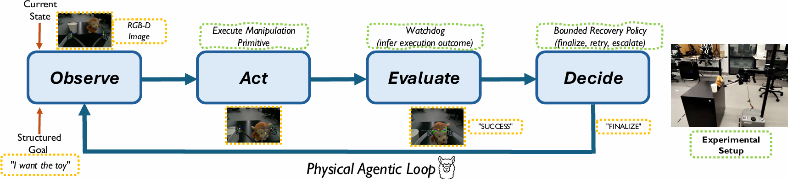

<p align="center">
  <h1 align="center">A Physical Agentic Loop for Language-Guided Grasping with Execution-State Monitoring</h1>

  <p align="center">
    <a href="https://www.linkedin.com/in/wenze-wang-a43672235" target="_blank">Wenze Wang</a>
    &nbsp;&nbsp;&nbsp;&nbsp;
    <a href="https://m80hz.github.io/" target="_blank">Mehdi Hosseinzadeh</a>
    &nbsp;&nbsp;&nbsp;&nbsp;
    <a href="https://ferasdayoub.com/" target="_blank">Feras Dayoub</a>
  </p>

  <h5 align="center">Australian Institute for Machine Learning (AIML), Adelaide University</h5>

  <p align="center">
    <a href="https://wenzewwz123.github.io/Agentic-Loop/" target="_blank">
      
    </a>
    &nbsp;
    <a href="https://arxiv.org/abs/2604.07395" target="_blank">
      
    </a>
    &nbsp;
    <a href="https://github.com/WenzeWWZ123/Agentic-Loop" target="_blank">
      
    </a>
    &nbsp;
    <a href="https://youtu.be/BaT5lDUizZE" target="_blank">
      
    </a>
  </p>
</p>

<p align="center">
  
</p>

---

## Overview

We propose a **physical agentic loop** for language-guided robotic grasping with execution-state monitoring.  
Instead of treating grasp execution as a one-shot black-box process, our system exposes runtime signals as structured states (e.g., *success*, *empty grasp*, *failure*), enabling decision-making during execution.

By integrating a lightweight monitoring module (**Watchdog**) with a bounded retry policy, the system can:
- detect execution outcomes in real time  
- perform a single automatic retry when appropriate  
- escalate to clarification when ambiguity persists  

This leads to improved robustness in cluttered and ambiguous real-world scenarios **without retraining the underlying grasp model**.

---

## Highlights

- 🔁 **Execution-aware decision loop** (observe → act → evaluate → decide)  
- 🧠 **Watchdog module** converts physical signals into discrete states  
- 🔧 **No retraining required** (wraps existing grasp model)  
- 🎯 **Robust under ambiguity and distractors**  
- ⚡ **Bounded recovery policy** (safe and interpretable)

---

## Code Release

> **🚧 Code coming soon.**  
> We are currently cleaning and organizing the repository for public release.

---

## Citation

If you find this work useful, please cite:

```bibtex
@article{wang2026physicalagenticloop,
  title   = {A Physical Agentic Loop for Language-Guided Grasping with Execution-State Monitoring},
  author  = {Wang, Wenze and Hosseinzadeh, Mehdi and Dayoub, Feras},
  journal = {arXiv preprint arXiv:2604.07395},
  year    = {2026},
  url     = {https://arxiv.org/abs/2604.07395}
}
